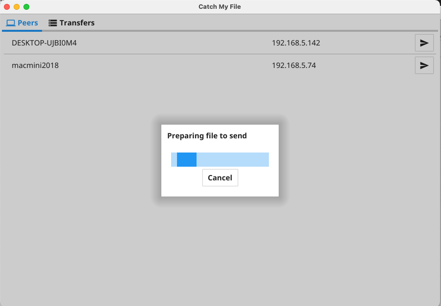

# Catch My File

Catch My File lets you easily send and receive files between the peers on the local network.

## Why?

I wanted a tool that allows to:

- Share a files between peers without managing shared folders or file servers
- Auto discover other peers without looking for IPs and/or ports to connect
- Be indepemdent of the platform where it runs
- No need for configuration or user accounts, just run and share

## Features

- Discover other peers on the local network without any configuration
- Send specific files to specific peers
- Accept or reject files sent by other peers
- Checksum (SHA256) verification of the file when transfer is completed
- Log display for relevant messages

## Installation

- Download the required package from the releases page
- Extract the package and run the application

## Usage

### Peers Panel

This panel will show all the other peers using the application on the local network. Pressing **Send File** we can select a file from the filesystem and send it to that peer.

### Sender

After the file is selected a checksum(SHA256) is generated and a file transfer request is sent to the target peer.

### Sending Panel

After the request is send a record is added to the Sending tab where we can follow the progress.

### Receiver

When a peer receives a request to accept a file, a modal is shown showing that information.

### Receiving Panel

After a request is received we can **Accept** or **Reject** it, if rejected nothing will be transferred.

When accepted we select where on the filesystem the file will be stored and the transfer start.

The sender can also see the progress.

## Built With
- [Go](https://go.dev/)
- TCP Sockets - Data transfer between the peers
- Go Modules
  - [Zeroconf](https://github.com/grandcat/zeroconf) - Service registration and discovery
  - [Fyne UI](https://fyne.io/) - Cross platform GUI inspired by Material Design

## Development

### Requirements

- (Dev) Go >= 1.16 - https://golang.org/
- (Build) Fyne - https://github.com/fyne-io/fyne
- (Release) Fyne-Cross - https://github.com/fyne-io/fyne-cross

## License

Distributed under the Elipse Public License. See [LICENSE](LICENSE) for more information.
