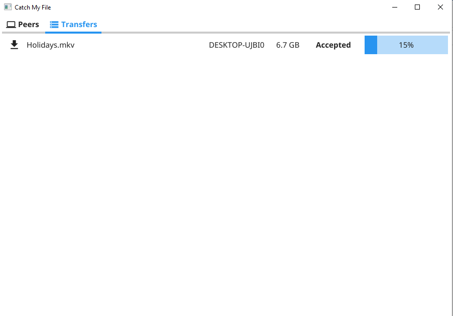

# Catch My File

Catch My File lets you easily send and receive files between peers on the local network.

## Why?

I wanted a tool that allows to:

- Share a files between peers without managing shared folders or file servers
- Auto discover other peers without looking for IPs and/or ports to connect
- Be indepemdent of the platform where it runs
- No need for configuration or user accounts, just run and share

## Features

- Discover other peers on the local network without any configuration
- Send specific files to specific peers
- Accept or reject files sent by other peers
- Follow the transfer progress
- Checksum (SHA256) verification of the file when transfer is completed

## Installation

- Download the latest [release](https://github.com/fabiodcorreia/catch-my-file/releases/latest) package
- Extract the package and run the application
- MacOS
    - Copy the application to the applications folder or just run it directly
    - On the frist run need to allow the app to run and make network connections
- Linux 
    - Run the command `sudo make install` to install the application
    - Run the command `sudo make uninstall` to remove the application
- Windows
    - Just run the executable

## Usage

### Peers Panel

This panel will show all the other peers using the application on the local network. Pressing send button we can select a file from the filesystem and send it to that peer.

### Sender

After the file is selected a checksum(SHA256) is generated and a file transfer request is sent to the target peer.

### Transfers Panel

After the request is send a record is added to the Transfers tab where the sender can follow the progress.

At the same time on the receiver side a similar record is added with the options to **Accept** or **Reject** the transfer, if rejected nothing will be transferred.

When accepted we select where on the filesystem the file will be stored and the transfer start.

The sender can also see the progress.

Once the transfer is completed on the sender side, the receiver will start the verification to insure the file integrity.

When the verification is completed with success the transfer will be completed.

## Built With
- [Go](https://go.dev/)
- TCP Sockets - Data transfer between the peers
- Go Modules
  - [Zeroconf](https://github.com/grandcat/zeroconf) - Service registration and discovery
  - [Fyne UI](https://fyne.io/) - Cross platform GUI inspired by Material Design

## Development

### Requirements

- (Dev) Go >= 1.16 - https://golang.org/
- (Build) Fyne - https://github.com/fyne-io/fyne
- (Release) Fyne-Cross - https://github.com/fyne-io/fyne-cross

## Changelog

The changelog can be founda at [CHANGELOG](CHANGELOG.md)

## License

Distributed under the Elipse Public License. See [LICENSE](LICENSE) for more information.
